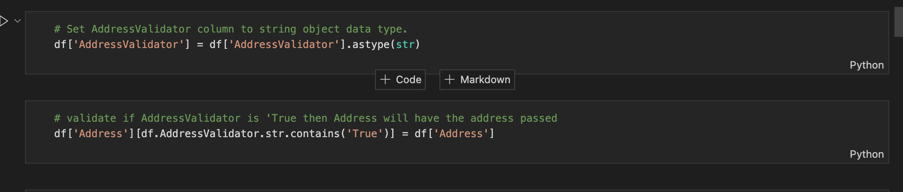

# CSV Normalization

## Introduction

The code within this project intends to normalize (or manipulate) data within a csv file using Python's [DataFrame](https://pandas.pydata.org/docs/reference/api/pandas.DataFrame.html) and Google's [Colaboratory](https://colab.research.google.com/?utm_source=scs-index). Python 3.7.12 ia used; however, older versions may be compatible.

## About Colab

The following project is implemented using Google's Colaboratory (also know as Colab).  Colab allows you to run Python code in isolation, as well as, manipulate and analyze data within a web browser.  You can create new code or text blocks by hovering over a pre-existing code or text block, then select the + sign.  

Colab files can be downloaded as a 'ipynb' or 'py'.  In this project, a 'ipynb' file was created.  Ipynb is a notebook document created by Jupyter Notebook.

## How to Run
Install jupyter:
`pip install jupyter` or `sudo -H pip install jupyter`

If you would like to run the web-based version of Jupyter, you can run:
`python -m notebook` or `jupyter notebook`

If you would like to run Jupyter from the command line, you can run:
`jupyter nbconvert --execute csv_conversion.ipynb > sampe.csv`
 